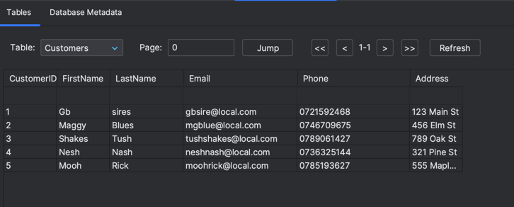

# sqlite3_basics

```python
conn = sqlite3.connect('DataWarehouse.db')
```
This line establishes a connection to an SQLite database file named "DataWarehouse.db" or creates it if it doesn't exist. The conn variable is an SQLite connection object.
```python
cursor = conn.cursor(): 
```

This line creates a cursor object from the connection. The cursor is used to execute SQL commands and interact with the database.


```python
cursor.execute("DROP TABLE IF EXISTS Customers;"): 
```

This SQL command checks if a table named "Customers" exists in the database. If it does, it is dropped (deleted). The IF EXISTS clause ensures that the command won't produce an error if the table doesn't exist
```python
cursor.execute('''CREATE TABLE IF NOT EXISTS Customers ( CustomerID INT PRIMARY KEY, FirstName VARCHAR(50), LastName VARCHAR(50), Email VARCHAR(100), Phone VARCHAR(20), Address VARCHAR(100) )'''): 
```

This SQL command creates a table named "Customers" with columns: CustomerID, FirstName, LastName, Email, Phone, and Address.


The following block inserts five records into the "Customers" table using the ``cursor.executemany()`` method. It specifies the values for each of the columns in the table.

```python
conn.commit(): 
```


This line commits the changes made to the database. Without this, the changes would not be saved permanently.

```python
conn.close(): 
```

This line closes the connection to the database, ensuring that resources are released.

